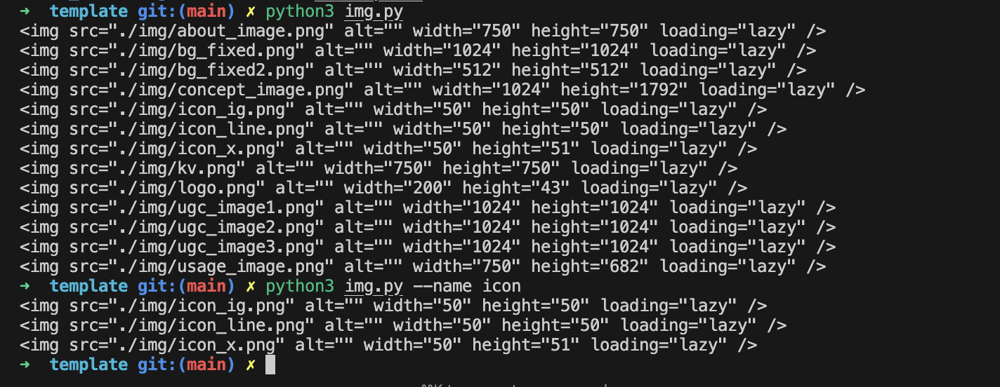

# Output Image Tag プロジェクト仕様書



## 概要
このプロジェクトは、指定されたディレクトリ内の画像・動画ファイルから、HTMLの`img`タグ、`video`タグ、`picture`タグを自動生成するPythonスクリプト群です。

## ファイル構成
- `img.py` - imgタグ・videoタグ生成スクリプト
- `picture.py` - pictureタグ生成スクリプト

## 機能詳細

### img.py
#### 目的
画像・動画ファイルから適切なHTMLタグ（`img`または`video`）を生成する

#### 対応ファイル形式
- 画像: `.png`, `.jpg`, `.jpeg`, `.gif`, `.svg`, `.webp`
- 動画: `.mp4`

#### コマンドライン引数
- `--name`: ファイル名のフィルタリング（部分一致）
- `--dir`: 検索対象ディレクトリの指定（`img`ディレクトリ内の特定サブディレクトリ）

#### 動作仕様
1. ベースディレクトリ `img` を基準とする
2. `--dir`オプション指定時は指定されたサブディレクトリのみを検索
3. `--dir`オプション未指定時は`img`ディレクトリ直下とすべてのサブディレクトリを検索
4. ファイルの重複処理を防ぐため、処理済みファイルを記録
5. ファイルをアルファベット順にソート
6. 各ファイルに対して適切なHTMLタグを生成：
   - `.mp4`ファイル: `<video>`タグ（`muted playsinline preload="metadata"`属性付き）
   - その他の画像ファイル: ``タグ（`loading="lazy"`属性付き）
7. 画像ファイルの場合、PILライブラリを使用して幅・高さを取得し、`width`・`height`属性を設定

#### 出力例
```html

<video src="./img/sample.mp4" muted playsinline preload="metadata"></video>
```

### picture.py
#### 目的
レスポンシブ対応のHTMLの`picture`タグを生成する

#### 対応ファイル形式
- 画像: `.png`, `.jpg`, `.jpeg`, `.gif`, `.svg`, `.webp`
- 注意: `.mp4`ファイルは除外（pictureタグは動画に対応していないため）

#### コマンドライン引数
- `--name`: ファイル名のフィルタリング（部分一致）
- `--dir`: 検索対象ディレクトリの指定（`img`ディレクトリ内の特定サブディレクトリ）

#### 動作仕様
1. ベースディレクトリ `img` を基準とする
2. ファイル検索ロジックは`img.py`と同様
3. 同じファイル名を持つ画像をグループ化（ディレクトリ構造を無視）
4. 各グループに対してディレクトリ別に画像を分類：
   - `pc`ディレクトリ: PC用画像
   - `sp`ディレクトリ: スマートフォン用画像
   - `img`直下: ルート画像
   - その他: その他のディレクトリの画像

#### レスポンシブ対応ロジック
1. **pcディレクトリがある場合**:
   - PC用（min-width: 768px）: pcディレクトリの画像
   - SP用: ルートディレクトリの画像（なければspディレクトリ）

2. **pcディレクトリがない場合**:
   - PC用: ルートディレクトリの画像
   - SP用: spディレクトリの画像（なければその他）

#### 出力パターン
1. **PC用・SP用両方がある場合**:
```html
<picture>
  <source media="(min-width: 768px)" srcset="./img/pc/sample.jpg">
  <source srcset="./img/sp/sample.jpg">
  
</picture>
```

2. **PC用のみの場合**:
```html
<picture>
  <source srcset="./img/sample.jpg">
  
</picture>
```

3. **SP用のみの場合**:
```html
<picture>
  <source srcset="./img/sp/sample.jpg">
  
</picture>
```

## 共通仕様

### 依存関係
- Python 3.x
- PIL (Pillow) ライブラリ

### エラーハンドリング
- PILで画像を開けない場合は、width・height属性なしのタグを生成
- ファイルが存在しない場合やアクセスできない場合は適切にスキップ

### ディレクトリ構造の想定
```
img/
├── sample1.jpg          # ルート画像
├── sample2.png          # ルート画像
├── pc/
│   ├── sample1.jpg      # PC用画像
│   └── sample2.png      # PC用画像
├── sp/
│   ├── sample1.jpg      # SP用画像
│   └── sample2.png      # SP用画像
└── other/
    └── sample3.gif      # その他の画像
```

### 使用方法
```bash
# 全ての画像からimgタグを生成
python img.py

# 特定の名前を含む画像のみ
python img.py --name "sample"

# 特定のディレクトリのみ
python img.py --dir "pc"

# pictureタグの生成
python picture.py

# pictureタグで特定の名前を含む画像のみ
python picture.py --name "sample"
```

## 特徴
- ファイルの重複処理を防ぐ仕組み
- アルファベット順でのソート
- レスポンシブ対応（picture.py）
- 適切なHTML属性の自動設定
- エラー耐性のある画像サイズ取得 